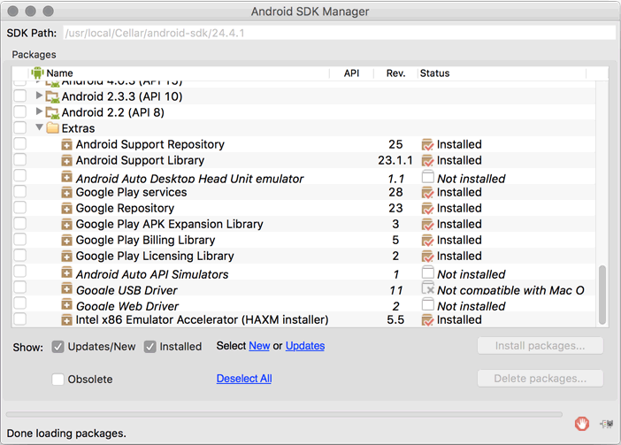

# react-native-android-geolocation
React Native Module to use Android Geolocation via Google Play API

### Installation

```bash
npm install --save react-native-android-geolocation
```

### Add it to your React Native android project

* In `android/setting.gradle`

```gradle
...
include ':RNAndroidGeolocation', ':app'
project(':RNAndroidGeolocation').projectDir = new File(rootProject.projectDir, '../node_modules/react-native-android-geolocation')
```

* In `android/app/build.gradle`

```gradle
...
dependencies {
    ...
    compile project(':RNAndroidGeolocation')
}
```

* In `MainActivity.java`

```java
import com.rnandroidgeolocation.AndroidGeolocationPackage;  // <--- Add import here

public class MainActivity extends Activity implements DefaultHardwareBackBtnHandler {

    private ReactInstanceManager mReactInstanceManager;
    private ReactRootView mReactRootView;

    @Override
    protected void onCreate(Bundle savedInstanceState) {
        super.onCreate(savedInstanceState);
        mReactRootView = new ReactRootView(this);

        mReactInstanceManager = ReactInstanceManager.builder()
                .setApplication(getApplication())
                .setBundleAssetName("index.android.bundle")
                .setJSMainModuleName("index.android")
                .addPackage(new MainReactPackage())
                .addPackage(new AndroidGeolocationPackage())  // <--- Add package command here
                .setUseDeveloperSupport(BuildConfig.DEBUG)
                .setInitialLifecycleState(LifecycleState.RESUMED)
                .build();

        mReactRootView.startReactApplication(mReactInstanceManager, "ChewApp", null);

        setContentView(mReactRootView);
    }

  ......

}
```

### Google Play API Installation

In case you haven't done it already, you will also need to install the corresponding Google Play SDK. To do this run

```bash
$ cd /path/to/your/android-sdk/tools
$ android sdk
```

and select the Google Play SDK extras as pictured below:




## Example
```javascript
var AndroidGeolocation = require('react-native-android-geolocation');

AndroidGeolocation.getCurrentLocation(
  (position) => this.setState({position: position}),
  (error) => this.setState({error: error})
);
```
## License

ISC
